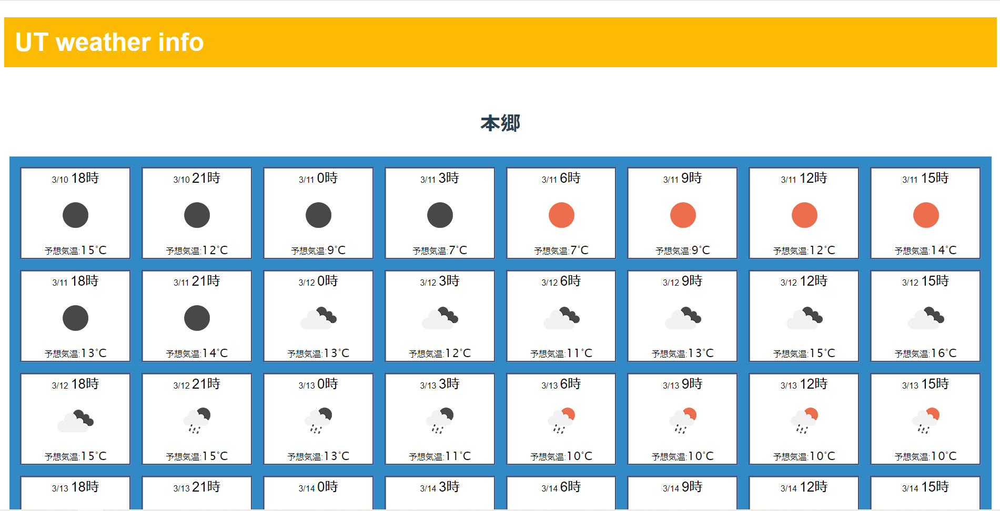

# UT Weather Map
## 概要
webAPIをVue.js上で使う練習のために，[Open Weather](https://openweathermap.org/) のwebAPIを用いて東大の本郷・駒場・柏キャンパスの天気予報が見られるアプリケーションを作成した．

JavaScriptのaxiosを使ってJSON形式の天気予報データをOpenWeatherのAPIから受け取り，Vue.jsで体裁を整えて表示している．

3時間ごとの気象予報が5日間文表示されるが多すぎるような気がするのでもう少し調整したほうがいいかもしれない．
## 今回用いたAPI
[OpenWeather API reference](https://openweathermap.org/forecast5)

## 今回用いた画像
[Weather icons](https://openweathermap.org/weather-conditions)

## スクリーンショット

